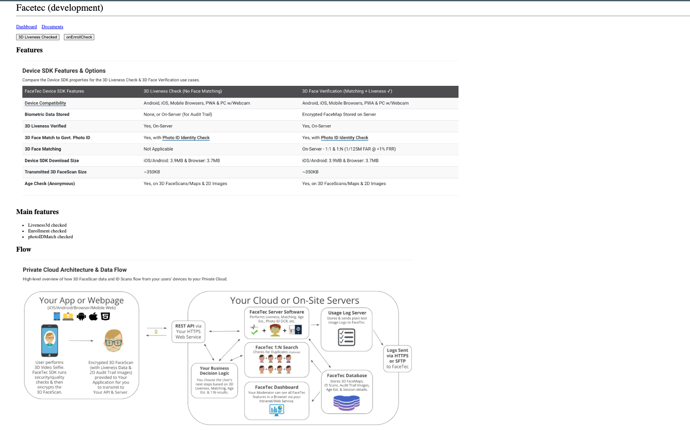

# 🚀 POC Facetec

Docs -> https://dev.facetec.com/

### Thunbnails



# Before run

You must change you credentials configuration variables at ./Config.js

- DeviceKeyIdentifier
- BaseURL
- PublicFaceScanEncryptionKey

## Installation

### 1.Install packages

```
$ npm install
```

### 2.Build packages

```
$ npm run build:dev
```

### 3.Run packages

```
$ npm run dev
```
